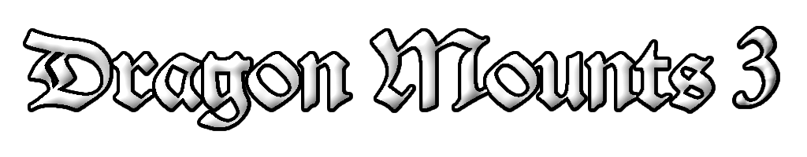

# [Dragon Mounts 3](https://www.curseforge.com/minecraft-bedrock/addons/dragon-mounts-3)
Dragon Mounts 3: Bedrock is the official bedrock port on Bedrock Edition. Created by HermitIsla, The add-on is about making useless ender dragon eggs hatcheable. You can tame the dragon like a pet, make it ride for you and soar in the skies. NOW on Bedrock Edition!

## License
The add-on's binaries, as well as its textures and code are licensed under the **GPLv3 license**.

- You CAN modify, copy and distribute this addon.
- You CAN use it privately or for commercial use.
- You CAN'T change the license of your modified version.
- You CAN'T make the modified source code closed.
- You HAVE TO indicate any changes in the modified version.

## Dragon Mounts 3: Bedrock Edition
The add-on is based off of the Java Edition of Dragon Mounts 2 mod by TheRPGAdventurer, for example: different breeds of dragons, each dragon needs the corresponding dragon egg hatching, the block dragon egg needs to right-click (touch screen operation for click on the screen dragon egg) to activate the dragon egg to start hatching, each dragon can be cut by the player using a diamond scissors to get the dragon scale. Dragon Scales can be synthesized into dragon scale equipment and so on.

## Dragon Mounts 3 Credits:
- HermitIsla - Lead Author of DM3
- TheRPGAdventurer - Former author of Dragon Mounts 2
- BarracudaATA - Open sourcing the mod to let others create projects under the Dragon Mounts name
- Tomanex - Dragon Mounts Team Founder and Beta Tester
- JDSK0ala - Dragon Mounts Team Founder and Beta Tester
- Various translators who made this add-on more accessible to players around the world and others who have provided small but welcome contributions such as textures
